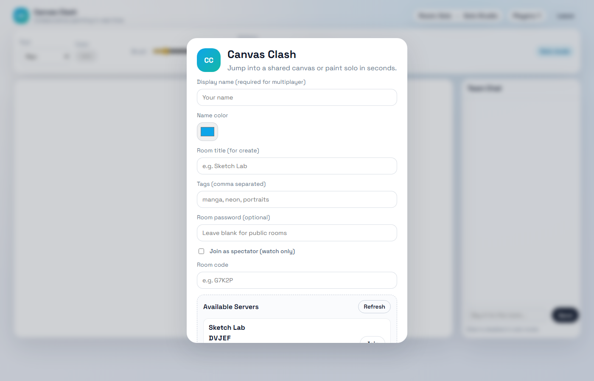
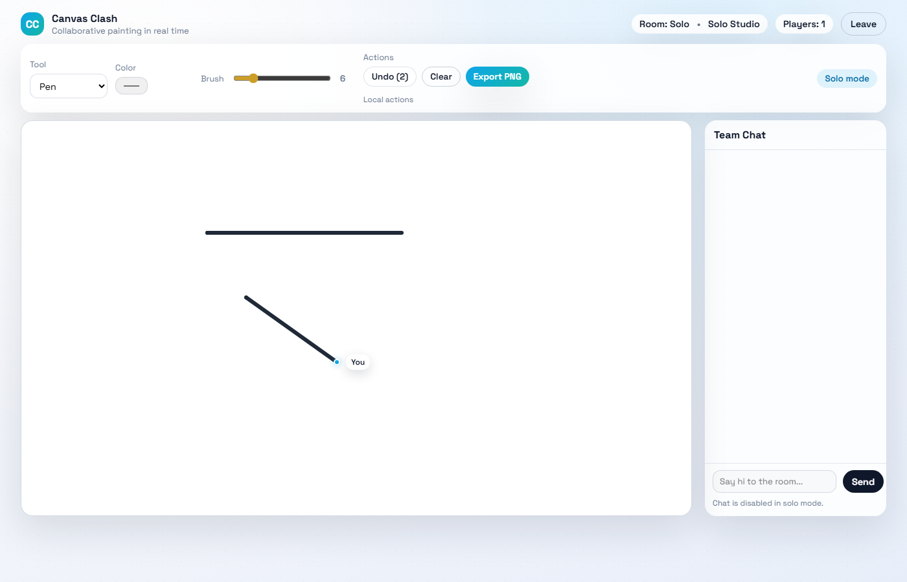
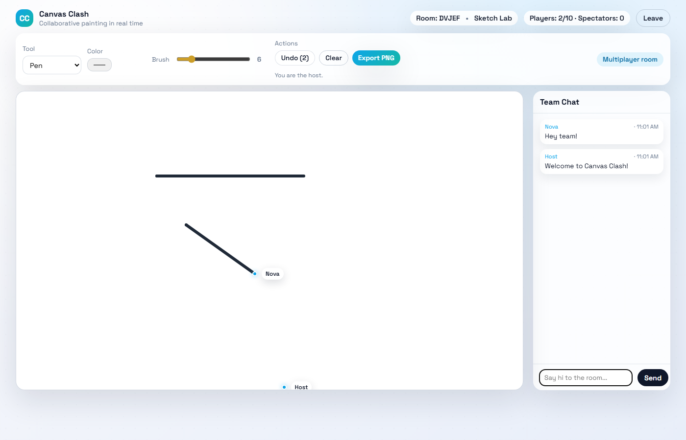

# Canvas Clash

Canvas Clash is a real-time multiplayer paint game with chat, shapes, undo/clear controls, spectator mode, and room discovery.

## How To Run

1. Open a terminal in the project folder.
2. Install dependencies:

```bash
npm install
```

3. Start the server:

```bash
npm start
```

4. Open your browser at:

```
http://localhost:3000
```

## How To Play

### Solo
1. Click **Play Solo** in the lobby.
2. Draw with the pen, shapes, or eraser.
3. Use **Undo**, **Clear**, or **Export PNG** on the toolbar.

### Multiplayer
1. Enter a **Display name** and choose a **Name color**.
2. (Optional) Enter a **Room title**, **Tags**, and **Room password** if you want a private room.
3. Click **Create Room** to host, or enter a room code and **Join Room**.
4. The room activates drawing when at least **2 players** are present.
5. Use the chat on the right side to communicate. Your name color appears in chat.

### Spectator Mode
1. Check **Join as spectator (watch only)** before joining a room.
2. Spectators do not count toward the 10-player limit and cannot draw.

## Controls & Tools

- **Tool dropdown**: Pen, Line, Square, Circle, Triangle, Eraser.
- **Color picker**: Set brush color (disabled for eraser).
- **Brush size**: Slider from 2-40.
- **Undo (host only in multiplayer)**: Rewinds the last 20 actions.
- **Clear (host only in multiplayer)**: Clears the canvas with confirmation.
- **Export PNG**: Downloads the current canvas as an image.

## Multiplayer Rules

- **Max players**: 10 (spectators are unlimited).
- **Min players**: 2 required before drawing begins.
- **Room passwords**: Optional. Locked rooms show a **Locked** tag in the lobby.
- **Overdraw**: Players can draw over each other's work.

## How It Works (High Level)

- **Server** uses Node.js + Express + Socket.IO.
- Each room stores:
  - `players` and `spectators`
  - `history` of draw events
  - `actionStack` for undo
  - `hostId`, `title`, `tags`, and `password`
- **Clients** send draw events (strokes or shapes) with a shared `actionId`.
- **Undo** removes the last `actionId` group and syncs the full history to clients.
- **Clear** wipes history and broadcasts a clear event.
- The **server list** is fetched from `/rooms` and refreshes automatically in the lobby.
- The **lobby panel is scrollable** so long forms stay usable on smaller screens.

## Project Structure

```
server.js                 # Express + Socket.IO server
package.json              # Dependencies and scripts
public/
  index.html              # UI layout
  styles.css              # Styling (UI scale at 100%)
  client.js               # Client logic and socket events
```

## Screenshots & Demo

Screenshots are stored in `docs/assets`:





Demo GIF:


## Notes

- The UI runs at **100% scale**, and the lobby card is scrollable for long forms.
- For external access, deploy the server and open the port (default 3000).

Go Online

https://adhrit-canvas-clash-new.onrender.com
